# How to use Omarchy Toggl Track


A Toggl timer that lives in the Omarchy bar, plus a record of what you actually
did all day, ready to file. It is built to be driven from the keyboard: you can
do everything below without touching the mouse.

Every screenshot on this page was taken from the real panel running against
invented data, so nothing here is anyone's actual work. See
[Regenerating these images](#regenerating-these-images) at the end.

## Install

```sh
omarchy plugin add https://github.com/Daz92/omarchy-toggl-track.git --enable
~/.config/omarchy/plugins/daz.toggl-track/setup   # paste your Toggl API token
omarchy-restart-shell
```

`setup` prompts for the token without echoing it, stores it in the desktop
secret service, checks it against Toggl, and finishes by reporting every
dependency it found — run `setup --check` any time to repeat that. It also
offers an optional local classifier: say yes and it downloads a small language
model that writes descriptions for you, entirely on this machine; say no and
everything else still works.

To hack on it instead, clone anywhere and link it in place with
`./install --dev --enable`.

## Opening it

Press <kbd>Super</kbd> + <kbd>Alt</kbd> + <kbd>T</kbd>, or click the Toggl icon
in the bar. The same key closes it. It always opens on the **Timer** scope.

There are three scopes, and you can move between them from anywhere:
<kbd>^t</kbd> timer, <kbd>^d</kbd> day, <kbd>^l</kbd> calendar.

---

## 1. The timer scope

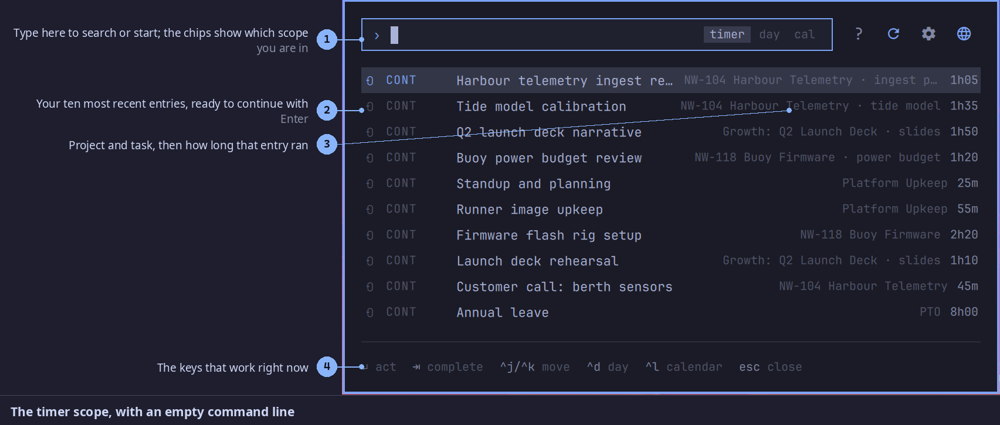

This is the front door. The box at the top is a command line, and with nothing
typed in it you are looking at your ten most recent entries. Move with
<kbd>&uarr;</kbd> and <kbd>&darr;</kbd>, press <kbd>Enter</kbd> to start that
work again.

## 2. Starting something new

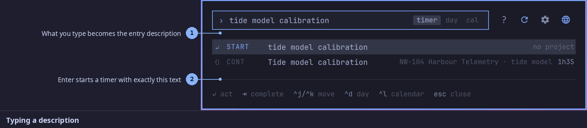

Just type. Whatever you write becomes the description, and the `START` row shows
exactly what will be sent. <kbd>Enter</kbd> starts it.

## 3. Filing it under a project

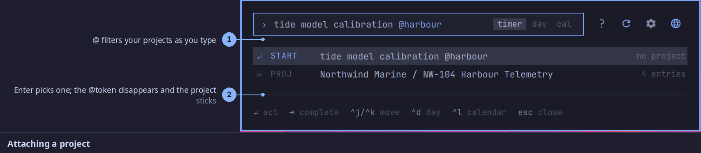

Type `@` and the list narrows to your projects. Pick one with <kbd>Enter</kbd>:
the `@token` disappears from the text and the project stays attached to what you
are about to start. Once a project is attached, `/` does the same for its tasks.

`#tag` adds a tag, and `$` marks the entry billable.

## 4. While the timer runs

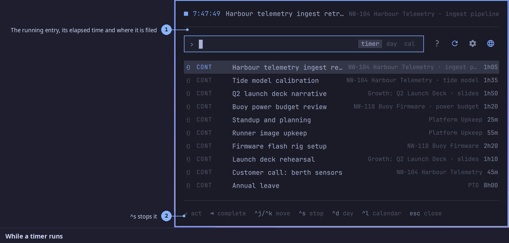

The running entry sits above the command line with its elapsed time, and the bar
widget shows it too, so you can see it without opening anything.
<kbd>^s</kbd> stops it.

---

## 5. The day scope

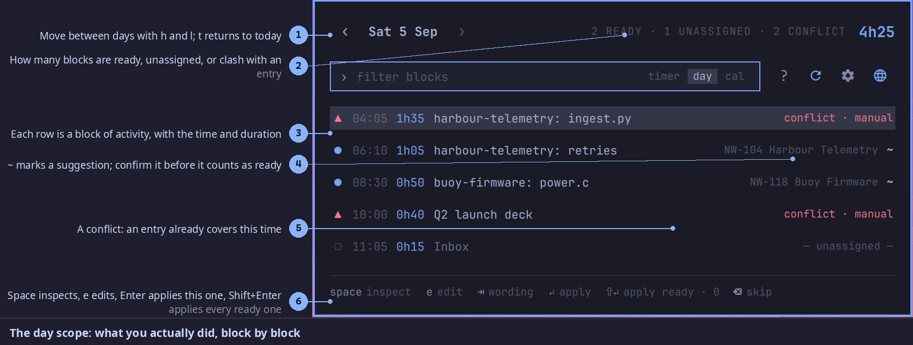

Press <kbd>^d</kbd>. This is the part that saves the most time: your day already
broken into blocks of activity, taken from ActivityWatch. Each row is a stretch
of work with its start time and duration.

The glyph on the left tells you where each block stands:

| Glyph | Means |
|---|---|
| `●` | ready to apply |
| `~` | a suggestion, waiting for you to confirm it |
| `▲` | a conflict: an entry already covers this time |
| `◌` | unassigned, nothing yet says which project it belongs to |
| `✓` | already written to Toggl |

<kbd>j</kbd> and <kbd>k</kbd> move between blocks, <kbd>h</kbd> and <kbd>l</kbd>
move between days, and <kbd>t</kbd> jumps back to today.

## 6. Looking inside a block

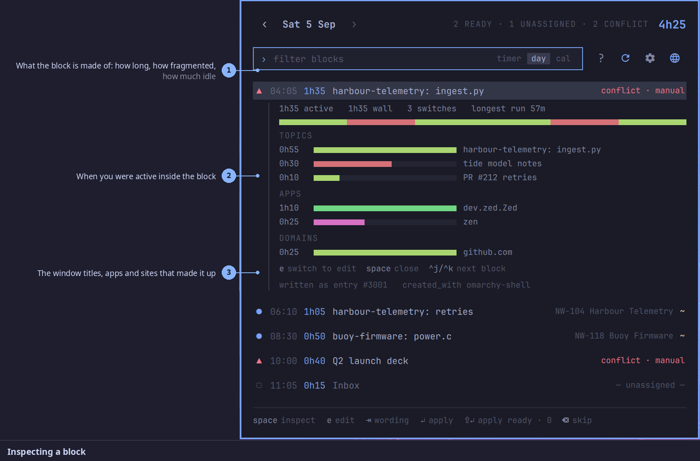

<kbd>Space</kbd> opens the block. You see how it was built: how long it ran, how
fragmented it was, how much was idle, and the window titles, apps and sites that
made it up. This is how you decide what a block was really about.

## 7. Fixing it, then filing it

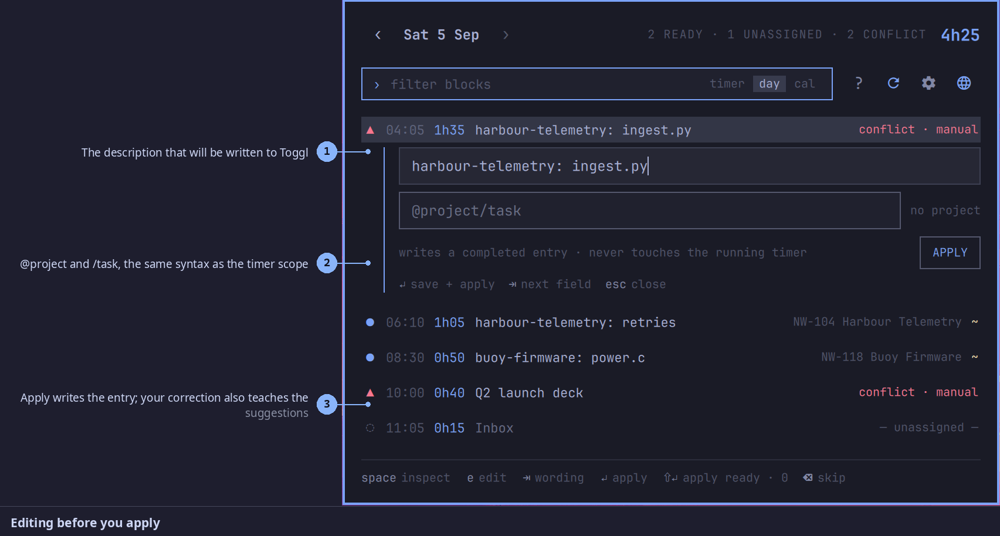

<kbd>e</kbd> opens the editor. Change the wording, attach a project with the same
`@project/task` syntax as the timer, then <kbd>Enter</kbd> to apply.
<kbd>Shift</kbd> + <kbd>Enter</kbd> applies every block that is ready.

<kbd>Tab</kbd> cycles the wording between what the local model suggested, what you
have written for similar work before, and the window title itself. Whatever you
pick or type teaches the next suggestion.

---

## 8. The week

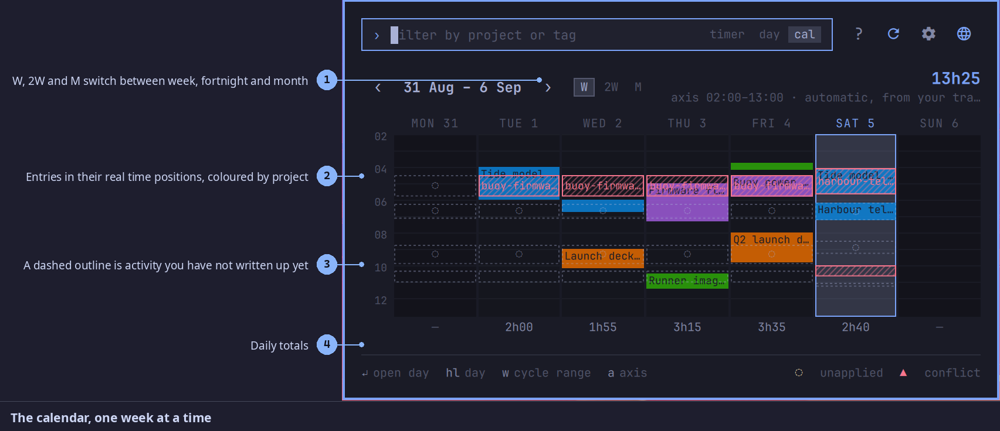

Press <kbd>^l</kbd>. Entries sit in their real time positions, coloured by
project. A dashed outline is activity you have not written up yet, and a hatched
one is a conflict. <kbd>w</kbd> cycles week, fortnight and month;
<kbd>&larr;</kbd> and <kbd>&rarr;</kbd> page through time.

## 9. The month

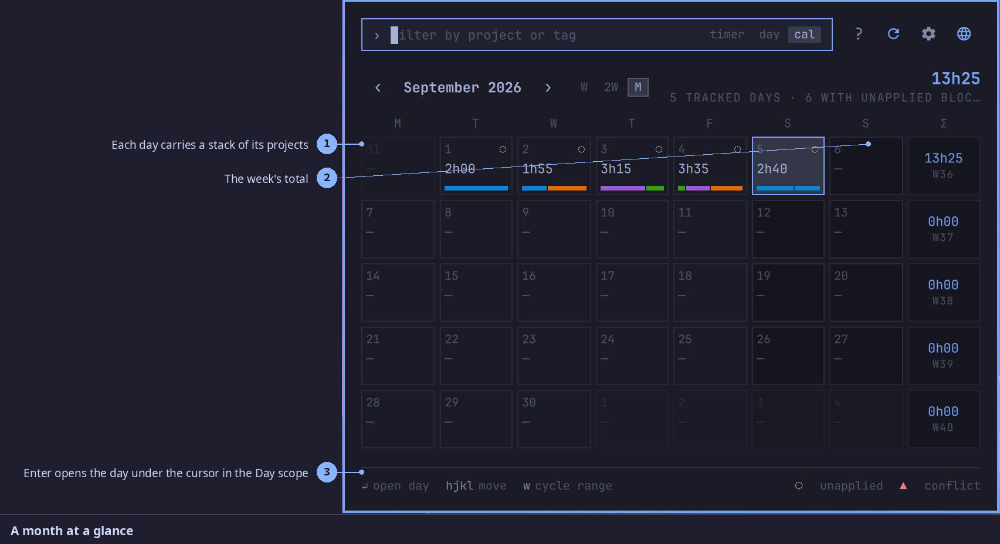

The same data at arm's length: each day carries a stack of its projects, with the
week's total on the right. <kbd>Enter</kbd> opens the day under the cursor in the
Day scope, so you can go straight from "that week looks thin" to fixing it.

---

## 10. Settings

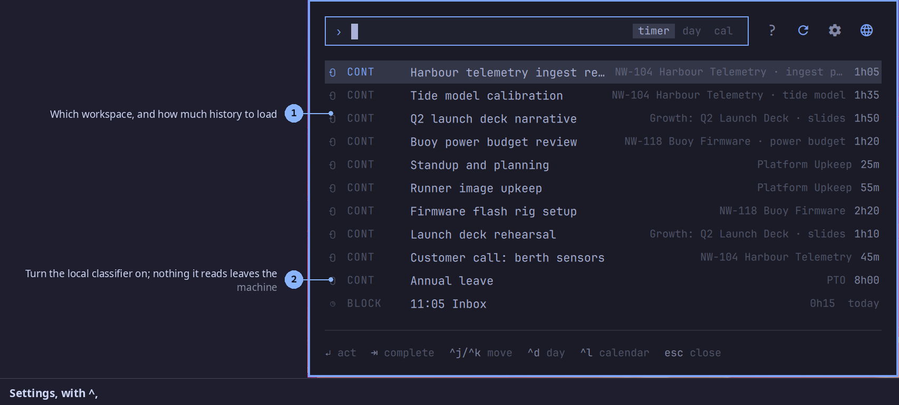

<kbd>^,</kbd> opens them. Pick your workspace, how much history to load, an idle
reminder, and whether the local classifier is on.

## 11. When you forget a key

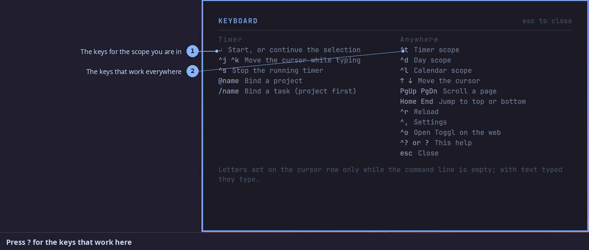

Press <kbd>?</kbd>. It shows the keys for the scope you are in on the left and
the ones that work everywhere on the right, so you never have to leave the panel
to look something up.

---

## Every key

Anywhere:

| Key | Does |
|---|---|
| `^t` | Timer scope |
| `^d` | Day scope |
| `^l` | Calendar scope |
| `↑ ↓` | Move the cursor |
| `PgUp PgDn` | Scroll a page |
| `Home End` | Jump to top or bottom |
| `^r` | Reload |
| `^,` | Settings |
| `^o` | Open Toggl on the web |
| `^? or ?` | This help |
| `esc` | Close |

Timer scope:

| Key | Does |
|---|---|
| `↵` | Start, or continue the selection |
| `^j ^k` | Move the cursor while typing |
| `^s` | Stop the running timer |
| `@name` | Bind a project |
| `/name` | Bind a task (project first) |

Day scope:

| Key | Does |
|---|---|
| `j k` | Move the cursor |
| `h l` | Previous or next day |
| `t` | Jump to today |
| `space` | Inspect the block |
| `e` | Edit the block |
| `⇥` | Cycle the wording |
| `↵` | Apply this block |
| `⇧↵` | Apply every ready block |
| `⌫` | Skip the block |

Calendar scope:

| Key | Does |
|---|---|
| `h j k l` | Move the day cursor |
| `← →` | Previous or next period |
| `t` | Jump to today |
| `w` | Cycle week, fortnight, month |
| `a` | Axis settings |
| `↵` | Open that day |

Letters only act on the row under the cursor while the command line is empty;
once you have typed something they type.

## Regenerating these images

The screenshots come from the real panel driven against a fixture backend, so
they can be rebuilt at any time and will never contain real entries:

```sh
python3 docs/capture.py        # drives the panel, writes docs/images/raw-*.png
python3 docs/annotate.py       # adds the callouts
./docs/render-overview.sh      # rebuilds the overview slide
```

`docs/capture.py` switches the plugin into demo mode, restarts the shell so no
real data is left in memory, takes its shots, and switches back afterwards.
The invented account lives in `toggl_demo.py`.

One caveat: the panel takes its colours from whatever Omarchy theme is
installed, so your own screenshots will not match these exactly.
