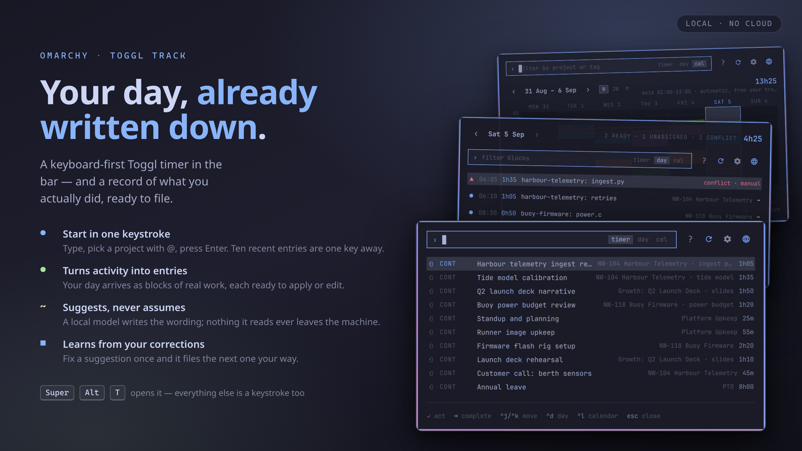

# Omarchy Toggl Track

[](HOW-TO.md)

**New here? [HOW-TO.md](HOW-TO.md) walks through the whole app in pictures.**

Omarchy Shell bar plugin for controlling Toggl Track without opening the web app.

The panel has three scopes: **Timer** for live tracking, **Day** for turning
already-recorded desktop activity into Toggl entries, and **Calendar** for
seeing a week or a month at once.

## Install

```bash
omarchy plugin add https://github.com/Daz92/omarchy-toggl-track.git --enable
```

Then store your API token and restart the shell:

```bash
~/.config/omarchy/plugins/daz.toggl-track/setup
omarchy-restart-shell
```

To work on the plugin instead, clone it anywhere and link it in place:

```bash
./install --dev --enable
```

Plugin code stays in this repository while Omarchy loads it through the symlink.

**After editing QML, run `omarchy-restart-shell`.** The shell keeps the plugin's
`Loader` alive across `omarchy-shell shell reloadConfig`, so panel changes only
appear once quickshell is restarted. Note that `omarchy-shell shell rescanPlugins`
is not a method this shell exposes — it prints nothing and exits 0, so it looks
like it worked.

To remove it:

```bash
./install --uninstall
```

This disables the plugin in the shell, then removes the installed folder or
symlink. The stored API token and cache are left untouched either way; add
`--purge` to also clear the token and delete the cache and model directory.
What happens to the log differs by install method: it lives inside the
installed folder itself, so a copy install's plain `--uninstall` deletes it
along with everything else, while a `--dev` uninstall removes only the symlink
and leaves the repository — logs included — untouched.

## Features

### Timer tab

- View the active timer and elapsed time in the bar
- Start, stop, and edit time entries
- Select workspace, project, tags, and billable status
- Search recent entries and active or archived projects
- Continue a past entry with one click
- Configure 30, 60, or 90 days of searchable history — Toggl rejects any
  `start_date` earlier than 91 days, so a longer range is not available
- Receive an optional reminder when idle with a timer running
- Open Toggl Track from the bar with right-click

### Day tab

Reads local activity recorded by ActivityWatch and proposes time entries for review.

A row is a **block**: a stretch of activity bounded by a real pause. Grouping by
application does not work — a measured day holds ~4,500 focus fragments in ~340
title runs whose longest is 12 minutes, because the work itself means switching
between an editor, a browser and a chat client every couple of minutes. So each
block reports the topics seen inside it instead, and one day becomes ~10 rows
rather than 168.

- Blocks account for **all** active time; nothing is discarded
- Idle time is removed using the ActivityWatch AFK bucket
- Screensaver and lock surfaces are excluded
- Each row collapses to one line: time, duration, headline topic, and an
  `also` line naming the other topics in the block
- Click a row to expand it: description, project, task, and the full topic
  breakdown with per-topic time
- Assign a project and task, then apply one block or every assigned block
- Blocks already covered by an entry this plugin created show as applied
- Blocks overlapping a foreign entry show as a conflict and are never written over
- Step through days, or jump back to today
- Set the break that separates blocks (2/5/10/15 min) from the gear icon;
  changing it reloads the day

Applying a block creates a completed historical entry tagged
`created_with: omarchy-toggl-track/day`. It never stops or edits a running timer,
and the server rejects any entry that would overlap an existing one.

Browser page detection, injected timer buttons, URL matching, and tab-close actions
remain browser-extension features. This plugin provides the native timer workflow.

## Requirements

- Omarchy Shell with third-party plugin support
- Python 3.9 or newer (`zoneinfo`, used for the local day boundary)
- `secret-tool` from libsecret — in Omarchy's base install
- `notify-send` for optional idle reminders
- A Toggl Track API token
- For the Day tab: a running ActivityWatch server on `http://127.0.0.1:5600`
  exposing `currentwindow` and `afkstatus` buckets. **This is not part of
  Omarchy**, so `setup` offers to install it — see
  [ActivityWatch](#activitywatch) below. A `web.tab.current` bucket, if
  present, adds browser domains.
- For `setup --secure-keyring` only: `python-gobject` — also in Omarchy's base
  install
- For the optional local classifier: `systemd --user`, and either the
  `llama-server` binary from `llama.cpp` already on `PATH`, or enough disk to
  let `setup` fetch one, plus the 901 MB description model and 35 MiB embedder

Nothing here is checked by hand. `setup` ends by running every check, and
`setup --check` repeats them at any time:

```
Runtime
  [  ok  ] python3            3.14.7
  [  ok  ] secret-tool        token storage (libsecret)
Token
  [  ok  ] secret service     org.freedesktop.secrets is answering
  [ warn ] keyring            login keyring. Omarchy's default keyring has no
                              password, so the token is stored unencrypted
  [  ok  ] accepted by Toggl  signed in as …
ActivityWatch
  [  ok  ] currentwindow      window titles, last event 2026-09-05T23:17:21Z
```

A **failure** is something the plugin cannot work without; a **warning** is
something optional, or a choice you may want to revisit. `setup --check
--offline` skips the one check that leaves the machine. Add `--json` to
`toggl_doctor.py` for a machine-readable report.

## Connect Toggl Track

Find your API token in Toggl Track profile settings, then run:

```bash
./setup
```

The script prompts without displaying the token, stores it in the desktop secret
service, and verifies it against Toggl. The token is never written to plugin files,
shell configuration, command arguments, or logs.

Open the bar widget after setup. The plugin selects your active or default workspace;
you can switch workspaces in the panel.

## Where your token is kept

The token goes into the desktop secret service through libsecret — the same
place your browser and mail client keep theirs. It reaches `secret-tool` on
standard input, so it never appears in a command line, in `/proc`, or in shell
history, and `tests/test_toggl_api.py` asserts it never reaches a log or a
request URL.

**On Omarchy that store is not encrypted.** Omarchy's installer creates a
*passwordless* login keyring (`install/user/default-keyring.sh`) and removes
`pam_gnome_keyring` from the SDDM auth stack, so nothing ever has to be
unlocked — and a gnome-keyring with no password is written to disk in the
clear. Your Toggl token is readable in
`~/.local/share/keyrings/Default_keyring.keyring`, protected by file
permissions (`0600`) and nothing else. Any program running as you can read it,
and so can an unencrypted backup. That is Omarchy's deliberate trade, not this
plugin's, and it applies to every secret on the machine.

If you would rather not accept it here:

```bash
./setup --secure-keyring    # move the token to a keyring with its own password
./setup --unlock            # unlock it once per login session
./setup --plain-keyring     # move it back
```

`--secure-keyring` creates a separate collection named *Omarchy Toggl Track*,
encrypted at rest with a password only you know, and moves the token into it.
The cost is real: the keyring is locked after every login, and the panel cannot
ask you for the password — a lookup against a locked keyring blocks on a
graphical prompt, so the plugin refuses instead and tells you to run `setup
--unlock`. Until you do, the panel shows that message rather than your timers.

Polkit is not involved and would not help. Polkit authorises *privileged*
actions; an API token is an ordinary user secret with no privilege boundary to
cross. The Secret Service API is the right mechanism, and it is the one in use.

## ActivityWatch

The Day scope reads a local ActivityWatch server. Omarchy does not ship one, so
`setup` offers to install it when nothing answers on `http://127.0.0.1:5600`,
and `setup --activitywatch` installs it on its own. `--skip-activitywatch`
declines without being asked, and a non-interactive `setup` never installs it.

Two pieces, neither needing elevated privileges:

- **awatcher** through mise (`mise use -g github:2e3s/awatcher`), because the
  Python watchers in the official bundle cannot see Wayland windows, which is
  the whole point here. Without mise, the pinned release asset is downloaded
  and checked against its published SHA-256 instead.
- **aw-server-rust**, which publishes no releases of its own and so comes out
  of the official ActivityWatch bundle: a 198 MB download for the one 29 MB
  binary it contains. The prompt says so before fetching anything. It is
  pinned by size and SHA-256, and that SHA-256's MD5 matches the one the AUR's
  `activitywatch-bin` package publishes independently.

Both land in `$XDG_DATA_HOME/omarchy-toggl-track/bin`, with two `systemd --user`
units to run them. **Existing unit files are never overwritten.** If you already
have ActivityWatch — from your distribution, or from the Omalog plugin, which
installs the same two services — setup leaves its units exactly as they are.
Two servers on port 5600 is worse than one of them being a version behind.

## Local classifier (optional)

`setup` offers a second, skippable stage: two local `llama-server` instances
and their models, all under `$XDG_DATA_HOME/omarchy-toggl-track`. Declining is
the default — nothing downloads unless you say yes, and `setup` run
non-interactively declines it; `setup --classifier` installs it without
questions.

The work is split, because measuring said so:

- **The project is decided by your own history**, not by a language model. A
  35 MB embedder (bge-small-en-v1.5) turns each block into a vector, and the
  project is whichever one your past entries and their centroids best support.
  On a real 26-block evaluation the language models managed 4–65% here; simply
  counting your most-used project managed 81%.
- **The description is written by a small language model** (granite-4.0-1b,
  901 MB), one call per block, shown the block and nothing else. Batching a
  day into one call scored near zero, and anything else placed in the prompt
  came back copied verbatim.

Where a GPU with a Vulkan driver exists, the chat model runs on it; otherwise
everything runs on the CPU. Force one with `TOGGL_CLASSIFIER_PROFILE=gpu` or
`cpu` before `./setup`. Both models are verified against a pinned SHA-256
before reuse and after every download.

Both services unload their models after **60 seconds without inference** and
reload them on the next request. The first suggestion after idle may take
longer. Each server uses one inference slot with its prompt-state cache
disabled; the embedder explicitly stays on the CPU. Service-local allocator
limits return more unused heap memory after unloading.

To apply these memory settings to an existing installation:

```bash
./setup --update-runtime
```

This preserves the API token, downloaded models, executable paths, service
environment, and enablement. It backs up each changed unit with a
`.before-memory-update` suffix and restarts only services that are already
running.

It reads window titles to do its job. That is the whole reason it runs locally
instead of calling a hosted API: nothing it reads ever leaves this machine.
Turn it on with the `classifier` setting in the panel (`Off`/`Local`).

Day blocks appear before model enrichment finishes. Suggestions run in the
background, keeping timer actions and applying entries available while models
wake or respond. Applying a completed entry does not wait for embedding;
its learning signal is saved locally for later enrichment.

Successful embeddings and generated descriptions are cached under
`$XDG_CACHE_HOME/omarchy-toggl-track/inference` (usually
`~/.cache/omarchy-toggl-track/inference`). Results expire after 24 hours, with
a combined 16 MiB limit across account/workspace partitions. Deleting this
cache safely forces recomputation; models and learned history remain under
`$XDG_DATA_HOME`.

```bash
./setup   # re-run any time; the token stage is skipped when one is stored (--reset to replace)
```

## History store

The panel learns what you call your work. Every block already covered by a
Toggl entry — one the panel applied, or one you typed into the Toggl web app —
teaches a local store which description and project go with which window
titles, apps and sites. On later days a close match shows up as a `~` guess
(confirm with Space, never applied on its own). Your history supplies project
rankings and wording candidates. The description model receives only the
block's activity, keeping past labels out of its prompt.

The store is plain JSON you may edit or delete:
`$XDG_DATA_HOME/omarchy-toggl-track/history.json` (usually
`~/.local/share/omarchy-toggl-track/history.json`). Nothing leaves your
machine.

The store also keeps what the panel *offered* against what you actually
applied. Correcting a suggestion is how the system learns: your wording joins
the candidate list, and your project choice moves that project's centroid.
`Tab` on a day row cycles the wording candidates — the model's phrasing, your
own past wording, the window title.

Score the layers against your own history at any time:

```sh
echo '{"action":"evaluate","workspace_id":YOUR_WORKSPACE_ID,"days":30}' | python3 toggl_api.py
```

It replays every block a real entry covers, leave-one-out, and reports project
accuracy and description overlap per layer, plus how often each suggestion
source survived correction. Add `"with_model":true` to include the language
model, at one request per block.

Seed it from the last month once ActivityWatch and your Toggl token are both
set up:

```sh
echo '{"action":"learn_history","workspace_id":YOUR_WORKSPACE_ID,"days":30}' | python3 toggl_api.py

# after upgrading from a store that predates the embedder, rebuild its geometry
echo '{"action":"learn_history","workspace_id":YOUR_WORKSPACE_ID,"days":30,"rebuild":true}' | python3 toggl_api.py
```

## Controls

Open the panel with **SUPER + ALT + T** (bound in `~/.config/hypr/bindings.lua`;
the same key closes it), or click the bar widget. It always opens on the Timer
scope. Press `?` inside it for this same reference, or click the `?` in its
header.

Everything below works without the mouse. Letters act on the cursor row only
while the command line is empty; with text typed they type.

Anywhere:

| Key | Does |
|---|---|
| `^t` | Timer scope |
| `^d` | Day scope |
| `^l` | Calendar scope |
| `↑ ↓` | Move the cursor |
| `PgUp PgDn` | Scroll a page |
| `Home End` | Jump to top or bottom |
| `^r` | Reload |
| `^,` | Settings |
| `^o` | Open Toggl on the web |
| `^? or ?` | This help |
| `esc` | Close |

Timer scope — the command line is a search box, and an empty one lists your ten
most recent entries to continue:

| Key | Does |
|---|---|
| `↵` | Start, or continue the selection |
| `^j ^k` | Move the cursor while typing |
| `^s` | Stop the running timer |
| `@name` | Bind a project |
| `/name` | Bind a task (project first) |

Day scope:

| Key | Does |
|---|---|
| `j k` | Move the cursor |
| `h l` | Previous or next day |
| `t` | Jump to today |
| `space` | Inspect the block |
| `e` | Edit the block |
| `⇥` | Cycle the wording |
| `↵` | Apply this block |
| `⇧↵` | Apply every ready block |
| `⌫` | Skip the block |

Calendar scope:

| Key | Does |
|---|---|
| `h j k l` | Move the day cursor |
| `← →` | Previous or next period |
| `t` | Jump to today |
| `w` | Cycle week, fortnight, month |
| `a` | Axis settings |
| `↵` | Open that day |

Moving the cursor scrolls the view to follow it, so a long day never strands the
selection off screen.

## Development checks

```bash
omarchy plugin validate .
python3 -m unittest discover -s tests -v
python3 -m py_compile toggl_api.py toggl_perf.py tests/test_toggl_api.py
node tests/test_model.mjs
bash -n setup
qmllint -I /usr/share/omarchy/shell Panel.qml
qmlformat Panel.qml >/dev/null
# On a running Omarchy desktop; opens no panel and performs no Toggl I/O:
python3 tests/run_qml_smoke.py
```

Neither QML tool is run against `BarWidget.qml`. The bundled `qmllint 1.0` and
`qmlformat` both predate typed function signatures such as `function open(): void`,
which Quickshell's `IpcHandler` requires, so both exit non-zero on valid code.
`qmlformat` is the reliable syntax gate for `Panel.qml`.

Note that `qmllint` writes nothing on failure. Check its exit status directly
rather than piping its output, or a failure will look like a pass.

Run `omarchy plugin validate .` against the repo itself, not against an installed
path. A symlinked plugin folder is not a canonical plugin folder, and `omarchy
plugin validate` rejects any path containing a symlink — including the top-level
symlink a `--dev` install creates.

## License

MIT — see [LICENSE](LICENSE).

Measured memory and latency results: [performance validation](docs/2026-09-05-performance.md).
